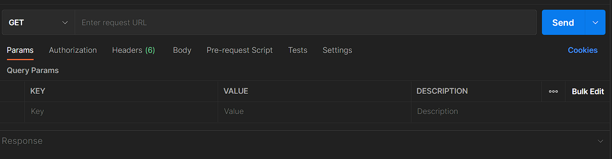

# Designing APIs with Swagger and Open API

- [Designing APIs with Swagger and Open API](#designing-apis-with-swagger-and-open-api)
  - [1 Introducing APIs and OpenAPI](#1-introducing-apis-and-openapi)
    - [1.1 What is an API ecosystem?](#11-what-is-an-api-ecosystem)
    - [1.2 Describing things](#12-describing-things)
      - [Bridget’s task](#bridgets-task)
      - [The potential of Bridget’s solution](#the-potential-of-bridgets-solution)
    - [1.3 What is OpenAPI?](#13-what-is-openapi)
      - [Example OpenAPI definition](#example-openapi-definition)
    - [1.4 Where do OpenAPI definitions fit in?](#14-where-do-openapi-definitions-fit-in)
    - [1.5 What is Swagger?](#15-what-is-swagger)
    - [1.6 What about REST?](#16-what-about-rest)
    - [1.7 When to use OpenAPI](#17-when-to-use-openapi)
      - [For API consumers](#for-api-consumers)
      - [For API producers](#for-api-producers)
      - [For API designers](#for-api-designers)
    - [1.8 This book](#18-this-book)
    - [Summary](#summary)
  - [2 Getting set up to make API requests](#2-getting-set-up-to-make-api-requests)
    - [2.1 The problem](#21-the-problem)
      - [armStall API overview](#armstall-api-overview)
      - [he first two operations of the FarmStall API](#he-first-two-operations-of-the-farmstall-api)
    - [2.2 Getting set up with Postman](#22-getting-set-up-with-postman)
    - [2.3 FarmStall API](#23-farmstall-api)
    - [2.4 Our first request](#24-our-first-request)
      - [Forming a GET request in Postman](#forming-a-get-request-in-postman)
      - [2.4.1 Forming a GET request in Postman](#241-forming-a-get-request-in-postman)
      - [2.4.2 Verification](#242-verification)
    - [2.5 Adding a review to the FarmStall API](#25-adding-a-review-to-the-farmstall-api)
      - [Forming a POST request in Postman](#forming-a-post-request-in-postman)
      - [Verification](#verification)
    - [2.6 Practice](#26-practice)
      - [Cat (and other animal) facts API](#cat-and-other-animal-facts-api)
      - [Random avatar API](#random-avatar-api)
      - [DuckDuckGo’s search engine API](#duckduckgos-search-engine-api)
      - [Pirate talk API](#pirate-talk-api)
    - [2.7 HTTP for the brave](#27-http-for-the-brave)
  - [3 Our first taste of OpenAPI definitions](#3-our-first-taste-of-openapi-definitions)
    - [3.1 The problem](#31-the-problem)
    - [3.2 Introducing the OpenAPI specification](#32-introducing-the-openapi-specification)
    - [3.3 A quick refresher on YAML](#33-a-quick-refresher-on-yaml)
      - [From JSON to YAML](#from-json-to-yaml)
    - [3.5 Extending our first operation](#35-extending-our-first-operation)
  - [4 Using Swagger Editor to write OpenAPI definitions](#4-using-swagger-editor-to-write-openapi-definitions)
    - [4.1 Introducing Swagger Editor](#41-introducing-swagger-editor)
      - [he Editor panel](#he-editor-panel)
      - [he UI Docs panel](#he-ui-docs-panel)
      - [he toolbar](#he-toolbar)
      - [ersistence](#ersistence)
    - [4.2 Writing the smallest OpenAPI definition in Swagger](#42-writing-the-smallest-openapi-definition-in-swagger)
      - [Editor](#editor)
      - [The smallest valid OpenAPI definition](#the-smallest-valid-openapi-definition)
      - [Writing in Swagger Editor](#writing-in-swagger-editor)
      - [A word on validation](#a-word-on-validation)
    - [4.3 Adding GET /reviews to our definition](#43-adding-get-reviews-to-our-definition)
    - [4.4 Interacting with our API](#44-interacting-with-our-api)
      - [Executing GET /reviews](#executing-get-reviews)
      - [Adding servers to our definition](#adding-servers-to-our-definition)
      - [Executing GET /reviews (again)](#executing-get-reviews-again)
  - [5 Describing API responses](#5-describing-api-responses)
    - [5.1 HTTP responses](#51-http-responses)
    - [5.2 The problem](#52-the-problem)
    - [5.3 The mind-blowing world of data schemas](#53-the-mind-blowing-world-of-data-schemas)
    - [5.4 JSON Schema](#54-json-schema)
      - [The type field](#the-type-field)
      - [Adding a field to an object](#adding-a-field-to-an-object)
      - [The minimum and maximum keywords](#the-minimum-and-maximum-keywords)
      - [Number vs. integer](#number-vs-integer)
    - [5.5 Status codes](#55-status-codes)
    - [5.6 Media types (aka MIME)](#56-media-types-aka-mime)
    - [5.7 Describing the GET /reviews response](#57-describing-the-get-reviews-response)
      - [Smallest response in OpenAPI](#smallest-response-in-openapi)
      - [The GET /reviews 200 response body](#the-get-reviews-200-response-body)
      - [Adding the rating field to our response body](#adding-the-rating-field-to-our-response-body)
      - [Describing message, uuid, and userId](#describing-message-uuid-and-userid)
  - [6 Creating resources](#6-creating-resources)
    - [6.1 The problem](#61-the-problem)
    - [6.2 Describing POST /reviews with a request body](#62-describing-post-reviews-with-a-request-body)
      - [Where to find request bodies](#where-to-find-request-bodies)
      - [Describing the schema for POST /reviews requestBody](#describing-the-schema-for-post-reviews-requestbody)
    - [6.3 Executing operations with request bodies](#63-executing-operations-with-request-bodies)
      - [Adding examples to make try-it-out look pretty](#adding-examples-to-make-try-it-out-look-pretty)
    - [6.4 Describing GET /reviews/{reviewId} with a path](#64-describing-get-reviewsreviewid-with-a-path)
      - [parameter](#parameter)
      - [Path parameters](#path-parameters)
      - [Describing the reviewId path parameter](#describing-the-reviewid-path-parameter)
    - [6.5 Verifying our reviews are getting created](#65-verifying-our-reviews-are-getting-created)
  - [7 Adding authentication and authorization](#7-adding-authentication-and-authorization)
    - [7.1 The problem](#71-the-problem)
    - [7.2 Getting set up for authentication](#72-getting-set-up-for-authentication)
      - [Challenge: Describe POST /users](#challenge-describe-post-users)
      - [Challenge: Describe POST /tokens](#challenge-describe-post-tokens)
      - [Solution: Definition changes](#solution-definition-changes)
      - [Verifying we can create users and get a token](#verifying-we-can-create-users-and-get-a-token)
    - [7.3 Adding the Authorization header](#73-adding-the-authorization-header)
      - [How OpenAPI handles authorization](#how-openapi-handles-authorization)
      - [Types of authorization (securities) supported in OpenAPI 3.0.x](#types-of-authorization-securities-supported-in-openapi-30x)
      - [Adding the Authorization header security scheme](#adding-the-authorization-header-security-scheme)
      - [Adding the security requirements to POST /reviews](#adding-the-security-requirements-to-post-reviews)
      - [Using the security feature of try-it-out](#using-the-security-feature-of-try-it-out)
    - [7.4 Optional security](#74-optional-security)
    - [7.5 Other types of security schemas](#75-other-types-of-security-schemas)
    - [7.6 How to add security schemes in general](#76-how-to-add-security-schemes-in-general)
  - [8 Preparing and hosting API documentation](#8-preparing-and-hosting-api-documentation)
    - [8.1 The problem](#81-the-problem)
    - [8.2 Adding metadata to the definition](#82-adding-metadata-to-the-definition)
    - [8.3 Writing the description in Markdown](#83-writing-the-description-in-markdown)
      - [Markdown basics](#markdown-basics)
      - [Adding a rich text description to the FarmStall API definition](#adding-a-rich-text-description-to-the-farmstall-api-definition)
    - [8.4 Organizing operations with tags](#84-organizing-operations-with-tags)
      - [Adding the Reviews tag to GET /reviews](#adding-the-reviews-tag-to-get-reviews)
      - [Adding descriptions to tags](#adding-descriptions-to-tags)
      - [Adding the rest of the tags](#adding-the-rest-of-the-tags)
    - [8.5 Hosting our API documentation using Netlify.com and](#85-hosting-our-api-documentation-using-netlifycom-and)
      - [Swagger UI](#swagger-ui)
      - [Preparing Swagger UI with our definition](#preparing-swagger-ui-with-our-definition)
      - [Hosting on Netlify.com](#hosting-on-netlifycom)
    - [8.6 The end of part](#86-the-end-of-part)
      - [Part 2 Design-first](#part-2-design-first)
  - [9 Designing a web application](#9-designing-a-web-application)
    - [9.1 The PetSitter idea](#91-the-petsitter-idea)
    - [9.2 PetSitter project kickoff](#92-petsitter-project-kickoff)
      - [Additional requirements](#additional-requirements)
      - [Team structure](#team-structure)
      - [API-driven architecture](#api-driven-architecture)
      - [The plan](#the-plan)
    - [9.3 Domain modeling and APIs](#93-domain-modeling-and-apis)
      - [Domain modeling for APIs](#domain-modeling-for-apis)
      - [Looking back on FarmStall](#looking-back-on-farmstall)
    - [9.4 A domain model for PetSitter](#94-a-domain-model-for-petsitter)
      - [Concepts in the model](#concepts-in-the-model)
      - [The User model](#the-user-model)
      - [The Job and Dog models](#the-job-and-dog-models)
    - [9.5 User stories for PetSitter](#95-user-stories-for-petsitter)
      - [What are user stories?](#what-are-user-stories)
      - [Collecting user stories](#collecting-user-stories)
      - [Mapping user stories](#mapping-user-stories)
  - [10 Creating an API design using OpenAPI](#10-creating-an-api-design-using-openapi)
    - [10.1 The problem](#101-the-problem)
      - [onverting a domain model to OpenAPI](#onverting-a-domain-model-to-openapi)
      - [nsuring reusability](#nsuring-reusability)
    - [10.2 Creating the schemas](#102-creating-the-schemas)
      - [tarting an OpenAPI file with schemas](#tarting-an-openapi-file-with-schemas)
      - [eferencing common schemas](#eferencing-common-schemas)
      - [he User schema](#he-user-schema)
      - [he Job schema](#he-job-schema)
      - [he Dog schema](#he-dog-schema)
      - [he JobApplication schema](#he-jobapplication-schema)
    - [10.3 The CRUD approach to API operations](#103-the-crud-approach-to-api-operations)
      - [Defining API requests and responses](#defining-api-requests-and-responses)
      - [From user stories to CRUD design](#from-user-stories-to-crud-design)
    - [10.4 API operations for PetSitter](#104-api-operations-for-petsitter)
      - [User operations](#user-operations)
      - [Job operations](#job-operations)
      - [JobApplication operations](#jobapplication-operations)
  - [11 Building a change workflow around API design–first](#11-building-a-change-workflow-around-api-designfirst)
    - [11.1 The problem](#111-the-problem)
    - [11.2 Communicating and reacting to change](#112-communicating-and-reacting-to-change)
    - [11.3 GitHub as our workflow engine](#113-github-as-our-workflow-engine)
      - [A single source of truth](#a-single-source-of-truth)
      - [Suggesting a change](#suggesting-a-change)
      - [Agreeing on a change](#agreeing-on-a-change)
      - [A way of viewing changes (based on an older version)](#a-way-of-viewing-changes-based-on-an-older-version)
    - [11.4 Tying the GitHub workflow together](#114-tying-the-github-workflow-together)
      - [Setting up GitHub and the source of truth](#setting-up-github-and-the-source-of-truth)
      - [Steps in our GitHub workflow](#steps-in-our-github-workflow)
    - [11.5 A practical look at the workflow](#115-a-practical-look-at-the-workflow)
      - [Creating and suggesting DELETE /jobs/{id}](#creating-and-suggesting-delete-jobsid)
      - [Reviewing and accepting changes](#reviewing-and-accepting-changes)
      - [Comparing older branches to the latest](#comparing-older-branches-to-the-latest)
      - [What we’ve done](#what-weve-done)
  - [12 Implementing frontend code and reacting to changes](#12-implementing-frontend-code-and-reacting-to-changes)
    - [12.1 The problem](#121-the-problem)
    - [12.2 Setting up Prism](#122-setting-up-prism)
      - [Installing Prism](#installing-prism)
      - [Verifying that Prism works](#verifying-that-prism-works)
    - [12.3 Building a frontend based on a mock server](#123-building-a-frontend-based-on-a-mock-server)
      - [Adding multiple examples into your OpenAPI definition](#adding-multiple-examples-into-your-openapi-definition)
      - [Using examples in Prism](#using-examples-in-prism)
    - [12.4 Identifying a missing API operation](#124-identifying-a-missing-api-operation)
      - [Due diligence for adding the operation](#due-diligence-for-adding-the-operation)
      - [Designing the new operation](#designing-the-new-operation)
      - [Choosing which mock data response to get from Prism](#choosing-which-mock-data-response-to-get-from-prism)
      - [Formalizing and suggesting the change](#formalizing-and-suggesting-the-change)
      - [Extra curl examples](#extra-curl-examples)
  - [13 Building a backend with Node.js and Swagger Codegen](#13-building-a-backend-with-nodejs-and-swagger-codegen)
    - [13.1 The problem](#131-the-problem)
    - [13.2 Introducing Swagger Codegen](#132-introducing-swagger-codegen)
      - [Client code generation](#client-code-generation)
      - [Server code generation](#server-code-generation)
      - [Swagger Generator](#swagger-generator)
    - [13.3 The backend structure](#133-the-backend-structure)
      - [Generating the backend](#generating-the-backend)
      - [Investigating the structure](#investigating-the-structure)
      - [OpenAPI changes](#openapi-changes)
    - [13.4 Updating OpenAPI for the backend](#134-updating-openapi-for-the-backend)
      - [dding operation IDs](#dding-operation-ids)
      - [agging API operations](#agging-api-operations)
      - [egenerating the backend stubs](#egenerating-the-backend-stubs)
    - [13.5 Running and testing the backend](#135-running-and-testing-the-backend)
      - [Testing with Postman](#testing-with-postman)
      - [Testing input validation](#testing-input-validation)
      - [Output validation with Prism](#output-validation-with-prism)
    - [13.6 Database persistence with Mongoose](#136-database-persistence-with-mongoose)
      - [Another API modification](#another-api-modification)
      - [Getting ready to use MongoDB](#getting-ready-to-use-mongodb)
      - [Configuring Mongoose in the project](#configuring-mongoose-in-the-project)
      - [Creating models](#creating-models)
    - [13.7 Implementing API methods](#137-implementing-api-methods)
  - [14 Integrating and releasing the web application](#14-integrating-and-releasing-the-web-application)
    - [14.1 The problems](#141-the-problems)
      - [Authentication](#authentication)
      - [Organizing code](#organizing-code)
      - [Serving both components](#serving-both-components)
    - [14.2 Implementing authorization](#142-implementing-authorization)
      - [Creating a security scheme](#creating-a-security-scheme)
      - [Adding a “Login” action](#adding-a-login-action)
      - [Defining operation security](#defining-operation-security)
    - [14.3 Managing repositories](#143-managing-repositories)
      - [Keeping the existing structure](#keeping-the-existing-structure)
      - [Creating a shared Git repository to implement both components](#creating-a-shared-git-repository-to-implement-both-components)
      - [Combining code and API definition in a repository](#combining-code-and-api-definition-in-a-repository)
      - [Making the choice and refactoring](#making-the-choice-and-refactoring)
    - [14.4 Setting up an integrated web server](#144-setting-up-an-integrated-web-server)
      - [RL design](#rl-design)
      - [erver setup](#erver-setup)
      - [art 3 Extending APIs](#art-3-extending-apis)
  - [15 Designing the next API iteration](#15-designing-the-next-api-iteration)
    - [15.1 Reviewing the first development sprint](#151-reviewing-the-first-development-sprint)
    - [15.2 Planning the next sprint](#152-planning-the-next-sprint)
    - [15.3 Preparing for new features](#153-preparing-for-new-features)
      - [Reviewing the domain model](#reviewing-the-domain-model)
      - [Reviewing user stories](#reviewing-user-stories)
    - [15.4 Improving the developer experience](#154-improving-the-developer-experience)
      - [Consistency](#consistency)
      - [Error handling](#error-handling)
      - [Input validation](#input-validation)
      - [Versioning vs. evolvability](#versioning-vs-evolvability)
  - [16 Designing schemas with composition in OpenAPI](#16-designing-schemas-with-composition-in-openapi)
    - [16.1 The problem](#161-the-problem)
    - [16.2 Polymorphism and inheritance in domain models](#162-polymorphism-and-inheritance-in-domain-models)
    - [16.3 Updating the schemas](#163-updating-the-schemas)
      - [The Pet schema](#the-pet-schema)
      - [The Dog schema](#the-dog-schema)
      - [The Cat schema](#the-cat-schema)
    - [16.4 Polymorphism and inheritance in OpenAPI](#164-polymorphism-and-inheritance-in-openapi)
      - [Composition inside the Dog and Cat schemas](#composition-inside-the-dog-and-cat-schemas)
      - [Composition inside the Pet schema](#composition-inside-the-pet-schema)
    - [16.5 Adding discriminators in OpenAPI](#165-adding-discriminators-in-openapi)
  - [17 Scaling collection endpoints with filters and pagination](#17-scaling-collection-endpoints-with-filters-and-pagination)
    - [17.1 The problem](#171-the-problem)
    - [17.2 Designing filters](#172-designing-filters)
      - [Projection filters](#projection-filters)
      - [Selection filters](#selection-filters)
      - [Handling nested schemas](#handling-nested-schemas)
      - [Query languages](#query-languages)
      - [Special conventions](#special-conventions)
    - [17.3 Filters for PetSitter](#173-filters-for-petsitter)
      - [Finding filter fields](#finding-filter-fields)
      - [Adding filters to OpenAPI](#adding-filters-to-openapi)
      - [Making a request](#making-a-request)
    - [17.4 Designing pagination](#174-designing-pagination)
      - [Offset-based and page-based pagination](#offset-based-and-page-based-pagination)
      - [Cursor-based pagination](#cursor-based-pagination)
    - [17.5 Pagination for PetSitter](#175-pagination-for-petsitter)
      - [Adding pagination to OpenAPI](#adding-pagination-to-openapi)
      - [Extending our request example](#extending-our-request-example)
    - [17.6 Designing sorting](#176-designing-sorting)
      - [Single-field sorting](#single-field-sorting)
      - [Multifield sorting](#multifield-sorting)
      - [Consistency throughout parameter types](#consistency-throughout-parameter-types)
      - [17.7 Sorting for PetSitter](#177-sorting-for-petsitter)
      - [Finding sorting fields](#finding-sorting-fields)
      - [Designing the sort parameter](#designing-the-sort-parameter)
      - [Adding sorting to OpenAPI](#adding-sorting-to-openapi)
      - [The final request example](#the-final-request-example)
  - [18 Supporting the unhappy path: Error handling with problem+json](#18-supporting-the-unhappy-path-error-handling-with-problemjson)
    - [18.1 The problem](#181-the-problem)
    - [18.2 Error categories](#182-error-categories)
      - [Finding unhappy paths](#finding-unhappy-paths)
      - [Common error patterns](#common-error-patterns)
    - [18.3 Requirements for error responses](#183-requirements-for-error-responses)
    - [18.4 The OAS tools format](#184-the-oas-tools-format)
    - [18.5 The problem+json format](#185-the-problemjson-format)
    - [18.6 Adding error responses to OpenAPI](#186-adding-error-responses-to-openapi)
      - [Creating error schemas](#creating-error-schemas)
      - [Adding errors to operations](#adding-errors-to-operations)
    - [18.7 Error-handling guidance](#187-error-handling-guidance)
      - [rontend development](#rontend-development)
      - [ackend development](#ackend-development)
      - [9 Improving input validation with advanced JSON Schema](#9-improving-input-validation-with-advanced-json-schema)
  - [19.1 The problem](#191-the-problem)
    - [19.2 Supported validations](#192-supported-validations)
      - [Read-only and write-only properties](#read-only-and-write-only-properties)
      - [Enforcing number constraints](#enforcing-number-constraints)
      - [Enforcing string formats](#enforcing-string-formats)
      - [Enforcing array constraints](#enforcing-array-constraints)
      - [Defining enumerations](#defining-enumerations)
      - [Listing required and optional properties](#listing-required-and-optional-properties)
      - [Setting defaults](#setting-defaults)
    - [19.3 Updating PetSitter schemas](#193-updating-petsitter-schemas)
      - [User schema](#user-schema)
      - [Job schema](#job-schema)
      - [JobApplication schema](#jobapplication-schema)
      - [Pet, Dog, and Cat schemas](#pet-dog-and-cat-schemas)
  - [20 Versioning an API and handling breaking changes](#20-versioning-an-api-and-handling-breaking-changes)
    - [20.1 The problem](#201-the-problem)
    - [20.2 What is a breaking change?](#202-what-is-a-breaking-change)
    - [20.3 Releasing a breaking change](#203-releasing-a-breaking-change)
      - [Coordinated breaking changes](#coordinated-breaking-changes)
      - [Multiple API versions](#multiple-api-versions)
      - [Using media types to version operations](#using-media-types-to-version-operations)
      - [Adding and deprecating features](#adding-and-deprecating-features)
  - [21 The API prerelease checklist](#21-the-api-prerelease-checklist)
    - [21.1 Pros and cons of a public API](#211-pros-and-cons-of-a-public-api)
    - [21.2 The checklist](#212-the-checklist)
    - [21.3 Getting the API working](#213-getting-the-api-working)
      - [Unit testing your API](#unit-testing-your-api)
      - [End-to-end testing](#end-to-end-testing)
    - [21.4 Documentation](#214-documentation)
    - [21.5 Getting your API consistent](#215-getting-your-api-consistent)
    - [21.6 Validation and error reporting](#216-validation-and-error-reporting)
    - [21.7 An API roadmap and exposure index](#217-an-api-roadmap-and-exposure-index)
    - [21.8 Getting a change strategy](#218-getting-a-change-strategy)
    - [21.9 Improving security](#219-improving-security)
    - [21.10 Monitoring your API](#2110-monitoring-your-api)
      - [Setting up metric collection](#setting-up-metric-collection)
    - [21.11 Releasing the API](#2111-releasing-the-api)
  - [appendix A Swagger 2.0, OpenAPI 3.0, and OpenAPI 3](#appendix-a-swagger-20-openapi-30-and-openapi-3)

## 1 Introducing APIs and OpenAPI

This chapter covers

- 🎯 Describing an API ecosystem
- 🎯 What OpenAPI and Swagger are
- 🎯 When to use OpenAPI

An overview of this book
In this chapter we’ll take a look at the world of APIs and OpenAPI so we
can give you an overview of the topics covered in this book. We’ll start by
looking at the benefits of describing an API, at how these descriptions form
part of an API ecosystem, and where OpenAPI fits in. We’ll look at an
example of an OpenAPI document and see when to use OpenAPI in practice.
Let’s get started.

### 1.1 What is an API ecosystem?

We like the word ecosystem. It describes the interactions and relationships
between living and nonliving things within a fully functioning environment.
We like to picture a wetland pond with frogs, wild grasses, and stones for
some reason, but you may imagine something a little different—either way,
the principle of an interactive, symbiotic system remains. If we borrow
(cough, maybe steal) this principle from biology, we can use it to describe
the world of APIs within a team or organization:

- The living, changing variables represent elements that we have control
  over. These are the things we make, such as our services, stacks, or
  code.

- The fixed, nonliving components are the useful things we can benefit
  from but cannot easily change. These are the libraries and external
  services we use.

- And, of course, there is the environment. It could be the internet, an
  internal network, or a tiny device stuck on the roof of our house—
  perhaps even all of them.

All of these pieces together form a complete ecosystem. When these parts
are moving in harmony, our system is healthy, and our developers,
consumers, and users are all happy. It is how these interactions and
relationships evolve that is central.

APIs define what each service is capable of providing and how others can
interact with that service. When we assume the role of an “API designer,”
our job is to create these APIs for services in a way that incorporates
feedback from consumers and ensures that changes are communicated ahead
of time.

Why “API ecosystem” and not “service ecosystem” or perhaps even just
“ecosystem,” you might ask? In this book we’re interested in APIs, so
naturally we’ll focus on that aspect. Since APIs are the contracts that hold
together the ecosystem, it is not an unreasonable focal point. APIs are a very
important part of the ecosystem, without which our services would be
isolated. Understanding APIs gives us a holistic perspective.

This book will focus on APIs and how OpenAPI helps make them easier to
work with.

### 1.2 Describing things

If we look at our ecosystem as individual services, we’ll fail to see how they
form a complete system. It’s how they are connected that gives us the bigger
picture. When those services change without updating all of their
dependencies, the ecosystem loses functionality and in some cases can
completely break.

Let’s look at a story that illustrates this idea.

#### Bridget’s task

Bridget has been tasked with managing a medium-sized web stack. Her stack
(or ecosystem) is made up of services that talk to and depend on each other.
The stack also makes use of external services that are beyond her control.
Every now and then, one of the APIs will change in such a way as to
negatively impact, and sometimes break, the services that rely on it. This
disrupts the ecosystem, bringing down parts of her stack and ultimately
causing failures.

Bridget needs to effectively solve this problem. When an API changes, she
needs to be able to tell the affected developers beforehand and keep the
ecosystem running smoothly.

Bridget takes a moment to think about how this ecosystem works. She
knows that each service has an API, and that each of those APIs is made up
of smaller operations. Each operation expects a certain input and generates a
resulting output. When an operation changes so that it requires different
inputs, any service that doesn’t adapt along with it will result in a systemic
failure. Similarly, if an operation changes to produce a different output, it
will cause other dependent services to break unless they are updated to
address those changes. Bridget concludes that tracking API changes is an
important part of keeping the overall functionality up. But how will she
know when an API has changed?

Bridget decides she needs a way of describing APIs so that she can compare
an old API with a new one to see if the new one has any breaking changes.
She writes a program that compares the description of an older API with that
of a newer version, generating a report. The report is simple and just tells her
if the new API has any breaking changes since the older version.

Happy with her plan, she instructs the developers to describe their APIs
using her format so that she can compare old with new. Aware that the
external services aren’t under her control, she keeps an eye on those
developments and describes them herself—she feels prepared for when those
external services change.

#### The potential of Bridget’s solution

Bridget’s solution is centered around the idea that APIs can be described,
that people can write these descriptions, and that software can understand
them.

While she only used that approach to solve one specific problem, there is
much potential for growth with those descriptions. They could serve as the
basis for generating more than just reports. For example, she could generate
documentation, test changes before building them, reduce the overhead of
boilerplate code, and much more.

Let’s take a look at how Bridget’s solution is used in the real world. Let’s
look at how OpenAPI works.

### 1.3 What is OpenAPI?

OpenAPI specifies a way of describing HTTP-based APIs, which are
typically RESTful APIs (more on what REST is later). An OpenAPI
definition comes in the form of a YAML or JSON file that describes the
inputs and outputs of an API. It can also include information such as where
the API is hosted, what authorization is required to access it, and other
details needed by consumers and producers (such as web developers).

Definitions can be written by hand or by tools, or even be generated from
code. Once an API has been written down, we say it has been described, and
it then becomes a platform that tools and humans can make use of. A typical
way of using API definitions is to generate human-readable documentation
from it.

#### Example OpenAPI definition


There is a fun little API for dog breeds and their images on the internet,
hosted at <https://dog.ceo>. To give you an example of what an OpenAPI
definition looks like, we’ve described a single operation along with some
other basic details of this Dog API (as a YAML file).


An OpenAPI definition can seem a little verbose at first glance, but you will
find some exceptionally useful information contained within. In this
example, we can learn a few things about the single operation it describes
and how to consume it. Don’t worry if you can’t make the connection
between the YAML file and every one of the following statements yet. We’re
just getting started, and we’ll unpack OpenAPI definitions step by step in
this book. That said, here is what we could discover in the preceding listing:

- The API is hosted at <https://dog.ceo/api>.
- There is a GET operation with the path
  /breed/{breedName}/images.
- This path has a part called breedName, and it is a required string.
  A successful response will give us a JSON array where each item is an
- object containing message and status fields.The message field is an array of strings that are URLs of dog images.

That is usable information. Developers can build clients to consume the API,
product managers can determine if the API suits their needs and meets their
standards, and documentation teams can use it as the basis for showing
human-readable documentation.

To use this OpenAPI definition, we could load it into a tool called Swagger
UI (we’ll discuss that later in the book), which renders human-friendly
documentation based on the definition and provides other small niceties. The
result would look something like figure


### 1.4 Where do OpenAPI definitions fit in?

Once we have an API definition, we can use tools to leverage them, build
bigger abstractions, and create more automated workflows. Definitions are
machine readable.

Figure 1.2 shows how OpenAPI definitions could fit into an organization’s
workflows. The definitions can be created by tools or by extracting
annotations from code. They are then transformed into API documentation,
server stubs, and client SDKs. This is just one example. Other workflows
could be designed, depending on the business cases.


Other workflows could include

- Automating parts of API testing
- Getting early feedback on the design of an API
- Ensuring API consistency
- Comparing API changes across versions

The beauty of OpenAPI is that once you have an OpenAPI definition, the
rest (pun intended) is simply a matter of leveraging it for your needs.

### 1.5 What is Swagger?

In the beginning there was Swagger UI and a rough guide for writing YAML
files that described HTTP APIs. Later, more tools were built that relied on
this guide, which soon became a specification and a standard. The tools and
this specification were collectively known as “Swagger.” The specification
grew more mature and was released as open source, which encouraged the
community to create even more tools. They soon began to contribute
features to the specification, which finally began to be adopted by large
companies.

In 2015 Swagger was adopted by SmartBear, which then donated the
specification part to the Linux Foundation (www.linuxfoundation.org).
During that transfer, the specification was renamed as the “OpenAPI
specification,” and SmartBear retained the copyright for the term “Swagger.”

Today, as a result of this historical quirk, you’ll find the terms used
interchangeably. Going forward, we are encouraged to use the term
“OpenAPI” to refer the heart of this ecosystem—the specification—and to
use “Swagger” to refer to the specific set of tools managed by SmartBear
(which includes Swagger UI, Swagger Editor, Swagger Parser, and at least a
dozen more). Many, many other tools are also built to use OpenAPI.

NOTE ⚠️ There is an old standard, the Web Application Description Language (WADL; pronounced
“waddle”), which was inspired by SOAP’s WSDL specification and used XML. It could have been
used instead of Swagger to describe HTTP APIs. The team working on Swagger used to joke, “Why
WADL when you can Swagger?” And so the name was born.

### 1.6 What about REST?

REST (representational state transfer) is a collection of ideas about how to
design networked systems (in particular, server/client systems). While REST
is not restricted to HTTP-based APIs, they are both closely linked in
practice. RESTful APIs now drive the majority of web servers on the
internet.

The principles of REST were outlined by Roy Fielding in his dissertation on
networked systems, which was released in the year 2000
(www.ics.uci.edu/~fielding/pubs/dissertation/top.htm). Whether an API is
RESTful or not is determined by how closely it adheres to the ideas (or
constraints) of that dissertation. What is considered RESTful or not is a little
subjective and sparks heated debates. Out in the wild, HTTP-based APIs
have to make trade-offs between what they require and how standard or
RESTful they are. It is a balancing act that all API producers have to
manage.

The ideas in REST aim to be simple and to decouple the API from the
underlying services that serve the API. It uses a request-response model and
is stateless, as all the information necessary to do something is contained
within the request.

One of the key ideas behind REST is that of a resource. Things such as user
accounts, billing reminders, or even the weather in San Francisco are all
resources, and each resource is identified by a URI. For a user’s account, we
might have the URI /users/123, which uniquely identifies a user resource
within the API.

Consumers will want to be able to do things to and with resources. Think of
these actions as verbs. HTTP has a set of well-defined ones, such as POST,
GET, PUT, DELETE, and PATCH, all derived from the ideas in REST. In
HTML, if you want to fetch data related to a resource, you would use theGET method. If you want to create a new resource, you could use the POST
method. In chapter 10 we’ll dive deeper into URL structures and HTTP
verbs.

Where REST starts and HTTP ends is a tricky question to answer, but the
rule of thumb is that HTTP is the protocol and REST is a way of designing
APIs. HTTP has incorporated many of the ideas of REST into its protocol,
which is why they are so closely related. Typically we’ll more often note
when an HTTP API is not RESTful, meaning that it doesn’t conform to the
design patterns outlined by REST.

OpenAPI was designed to describe as many HTTP-based APIs as possible,
but not all of them. Its major constraint (and a huge benefit of OpenAPI) is
that it is designed to allow tools to generate usable code from the definitions;
this came with the trade-off that not every facet of an API can be described,
because they can’t all be well defined enough in the specification for both
humans and machines.

A quick note about hypermedia ⚠️

In Fielding’s REST paper, he mentions the idea of hypermedia: a system of returning contextaware links in the form of URIs. For example, if you were to execute a GET on a
/users/{userId} resource, it could return a link (a URI) to the login operation for that
user and another to execute a password reset. The links are related to the resource (at that point
in time), and they decouple clients from needing to know those URIs outside of the response.
This is a crude description of a very powerful model.

Many REST purists point out that this is a sorely missed component of RESTful APIs. In
OpenAPI (particularly version 3.0.0+), support was added to help document these hypermedia
links, but their semantics are out of scope for the OpenAPI specification. OpenAPI can describe
what is required by hypermedia APIs, but not what each link should do. There are other
specifications that attempt to tackle describing those details. Here are a few:

- HATEOAS: <https://restfulapi.net/hateoas/>
- Siren: <https://github.com/kevinswiber/siren>
- Hydra: <https://www.hydra-cg.com/>

### 1.7 When to use OpenAPI

Always.

We hope that statement triggered the picture of grinning authors. We
couldn’t resist being snarky. But no, like all technologies, OpenAPI isn’t
always necessary. OpenAPI describes HTTP-based APIs (including RESTful
APIs), so when you’re tasked with designing, managing, and consuming an
HTTP API, using OpenAPI will give you value.

If you’re dealing with other API technologies that don’t leverage HTTP
semantics (like methods, URLs, headers, and bodies), OpenAPI will have
limited value to you. Examples of those API types include gRPC and
GraphQL.

In this section, when we talk about APIs, we’re referring specifically to
HTTP-based APIs.

#### For API consumers

When you’re required to consume an API, your first instinct might be to
reach for an SDK for that API written in your programming language. Many
of the popular APIs have put great care and effort into making these SDKs
available to consumers, but many other APIs simply don’t have the
resources to write SDKs for one or more languages. If the API has been
described with OpenAPI (whether by the producer or by you), you can
generate SDKs for many different languages. The SDK templates provided
by tools such as Swagger Codegen or OpenAPI Generator are usually
sufficient and will give you a good head start for developing clients. But
even more power can be extracted by customizing and creating templates
specific to your needs that will work with any API described by OpenAPI.

#### For API producers

Building APIs can be quite fun, particularly when you have a contract to
develop against, but building out the boilerplate of an HTTP server is less
fun once you’ve done it umpteen times. Automatically generating boilerplatecode and stubs from an OpenAPI definition gives you speed and consistency
(since you can customize the templates to your needs).

There are even more exciting methods of developing APIs, such as using
OpenAPI definitions during runtime to act as a router (having API
operations map to classes and methods in code) or as a validation layer
(where incoming requests will fail validation unless they conform to the
OpenAPI definition’s schema). Such practices are becoming more common
in microservice-oriented architectures where services are being built out at a
faster rate.

#### For API designers

API design has also been given more attention of late, and its importance
cannot be understated. While we’re a huge fan of Agile practices (short
feedback cycles) and the art of failing fast (bringing products to market
quicker to validate their success or failure), APIs should still be designed
with longevity in mind because changing them means changing the
consumers, which is typically beyond your control. (No one likes getting
stuck maintaining an old API!) OpenAPI is a medium for communicating to
both consumers and producers, allowing designers to get feedback early in
the process and to iterate based on that feedback.

Design becomes even more interesting when it comes to managing more
than one API. In those cases, consistency plays an important role.
Standardizing all your APIs on consistent patterns becomes possible when
you can measure those patterns. OpenAPI definitions offer one such
measurement.

### 1.8 This book

This book aims to help you understand how OpenAPI works, how it and the
associated tooling can be used to design APIs, and how you can create
advanced and very specific workflows for your team and organization.

OpenAPI is aimed at automating parts of your workflow and freeing your
team to accomplish more. The small upfront cost of describing APIs withOpenAPI is greatly offset by the power you can wield by leveraging it and
the new opportunities it presents.


This book is broken down into three parts:

- Part 1 deals with OpenAPI literacy and introduces you to the syntax and
structure of OpenAPI definitions, giving you the ability to describe
APIs. Throughout this part we’ll document an example FarmStall API
that is hosted online and is simple enough to easily understand without
knowing the details. We’ll use figure 1.3 to indicate where we are in the
scheme of things.
- Part 2 deals with the design phase and how we can use the tools to
create a new API and iterate its design. We’ll be designing a pet-sitting
API from scratch, along with the processes around it.
- Part 3 is a deeper dive into some more specific tools and workflows,
particularly related to releasing an API to the public.

### Summary

- OpenAPI is a specification for describing HTTP-based APIs, most
notably RESTful APIs.
- Swagger is a term that refers to a set of tools by SmartBear. It used to
refer to the OpenAPI specification itself and is sometimes still used that
way.
- Describing APIs by writing a definition (a YAML file) allows you to
leverage tools to automate a lot of API-related processes.
- OpenAPI is useful for consumers, producers, and API designers. Each
can benefit from knowing and utilizing tools that consume OpenAPI
definitions.
- This book will explain how to work with OpenAPI. With this
knowledge base, you can ultimately incorporate OpenAPI into your
team and organization workflows.

## 2 Getting set up to make API requests

This chapter covers

- Introducing the FarmStall API and some of its business logic
- Introducing a tool to make HTTP requests: Postman
- Executing API requests and inspecting the responses

Our task in this part of the book is to describe an API called FarmStall.
FarmStall was designed specifically for this book, and it is intentionally as
simple as possible. Before we can describe this API, we’ll need to
understand how it works and be able to make HTTP requests and inspect the
responses.

In this chapter we’ll use a tool called Postman to make HTTP requests
against the FarmStall API (see figure 2.1). We’ll be verifying that we get
decent-looking responses without concerning ourselves too much with the
details of those responses. We’ll also take a basic look at the business
domain of the API. We won’t go into great detail, but we’ll learn enough so
that we have an understanding of what we’re doing. This will make it easier
to describe later on.


These are the sources for the points we’ll be touching on:

- Postman—<https://getpostman.com>
- FarmStall API landing page—<https://farmstall.designapis.com>
- FarmStall API—<https://farmstall.designapis.com/v1/reviews>
- Source code (in Go)—<https://github.com/designapis/farmstall>

### 2.1 The problem

Our problem in this chapter is to discover and learn more about the
FarmStall API. In particular, we want to interact with it and confirm some
basics, such as how to access it, create requests, and inspect the responses.

First, let’s look at the API itself.

#### armStall API overview

The FarmStall API is hosted at <https://farmstall.designapis.com/v1>. The
API’s primary focus is to allow patrons of a farmer’s market to write up
reviews and give feedback on their experiences. Users can submit
anonymous reviews, which include a message and a rating (from 1 to 5inclusive). Users can also sign up to create reviews that will then be
associated with them. Once they are signed up, they can get a user token to
create reviews with their user ID.

#### he first two operations of the FarmStall API

The FarmStall API has several operations, and we’ll try out the following
two, summarized in table 2.1:

To get a list of public reviews, you can use GET /reviews. You can
also filter reviews by their rating by using the maxRating query
parameter.

To submit a new review, you can use POST /reviews. The body of
this request will include message and rating fields.


Based on the preceding information, including where the API is hosted
(<https://farmstall.designapis.com/v1>) and the details of each operation, we
can create our first two requests. Our task in this chapter is to verify that
responses come back from each operation and that they make sense to us.

So how do we make these HTTP requests? Fortunately for API folks, there
are numerous ways to make these requests—the brave may want to try their
hand using telnet, the practical may choose to use curl, and the rest of us
may prefer to use software suites with bells, whistles, and bunches of
utilities.

NOTE ⚠️ Although no one really writes HTTP requests by hand, we encourage you to give it a try. It
is actually quite satisfying when you form an HTTP request completely from scratch and get aresponse. We’ve included the small section 2.7 at the end of this chapter explaining how to craft a
request using low-level tools: telnet (for HTTP) and OpenSSL (for HTTPS).

There are many ways to make HTTP requests, and we’ve tried to structure
this book in such a way as to avoid requiring particular tools. However, we
still encourage you to try out the suggested tools as is, to more closely
follow along with our explanations. Perhaps you’ll discover features that you
can incorporate into your own arsenal.

Without further ado, let’s take a look at Postman.

### 2.2 Getting set up with Postman

Postman is a general HTTP tool that has a pleasant user interface and is
suitable for beginners and professionals alike. Postman has a lot of features,
and at first glance it can be a bit overwhelming. We’ll only be using a small
subset of them in this book.

We chose Postman as a tool for this book predominantly because of its
popularity (so that you’re not stuck using an esoteric tool like some that we
use) and because of the many features it provides. Some features you’ll find
useful, and others you might find inspirational.

In order to use Postman, you need to install it, so go ahead and download it
from www.getpostman.com/downloads/. There are versions for Microsoft
Windows, macOS, and most Linux distributions.

At the time of writing, Postman was at version 9.x, and your version may
look and act a little differently, depending on how much the authors of
Postman change it in the interim. The UI has been pretty stable, so it should
look similar to the screenshots in this chapter.

Also, when this book was being written, you did not need to create an
account with Postman in order to use it, although they will encourage you to
do so. There are free and paid-for plans, as well as the option to not create
any account at all. For this chapter we’ll assume you didn’t create an
account, so we’ll only use features that are available to unregistered users,
which should be ample for our purposes.
Go ahead and install Postman, we’ll wait. 😁

### 2.3 FarmStall API

To come to grips with the basics of creating an HTTP request, we’re going
to execute two of them: a GET request with query parameters and a POST
request with a JSON request body. We’ll progressively examine the details
of these operations as we go along. To start with, we’re going to focus more
on the practical side of making requests and less on what the operations are
actually doing.

NOTE  ⚠️ We designed the FarmStall API specifically for this book, to help us describe an existing
API. It wasn’t designed to handle production-level data, so the data in the FarmStall API will persist,
but only for a day or two. If you add a review one day and don’t see it the next, you’re not going crazy
—the API is just cleaning up so that it doesn’t overflow with too much data.

Let’s start by getting a list of reviews from the API.

### 2.4 Our first request

We’ll use the GET operation described at the beginning of this chapter to get
the list of reviews.

The details are listed in table 2.2. The GET method has at least one query
parameter called maxRating, which accepts a number from 1 to 5 inclusive.

[Using GET /reviews](Docs/img/8.png)

#### Forming a GET request in Postman

Operations are often described relative to where the server is hosted, and this
API has a base URL of <https://farmstall.designapis.com/v1>, so the URL for
GET /reviews becomes

```URI
https://farmstall.designapis.com/v1/reviews
```

If we add in the query parameter, it’ll form our final URL:

```URI
https://farmstall.designapis.com/v1/reviews?maxRating=5
```

Armed with the URL and method, we have enough to execute this particular
request—time to use Postman.

#### 2.4.1 Forming a GET request in Postman

If you haven’t done so already, start up Postman. Figure 2.2 shows the key

- areas in the main page that we are interested in for our GET request:
Method dropdown—This selects the method to use. The default will
likely be GET, but you can select it if not.
- URL input box—This is where you will enter the URL of the endpoint
you want to make the request against.
- Send Request button—This button executes the request.



To create a request against our endpoint, we need to enter the URL in the
URL input box and press the Send button, so go ahead and type<https://farmstall.designapis.com/v1/reviews?maxRating=5>.
Press Send, and a chunk of JSON data should be displayed (see figure 2.3).
This is the result of executing the request. If you see this JSON data—
congratulations, you’ve successfully executed a request!

small part of the response

```json
[
    {
        "message": "was pretty good.",
        "rating": 4,
        "uuid": "add5336b-6c80-43a5-94dd-5c116eba0591",
        "userId": null
    },
    {
        "message": "Not to bad",
        "rating": 3,
        "uuid": "4c38dd9e-8645-4667-b69d-c2d21ae1ec74",
        "userId": null
    },
    {
        "message": "neckbeard",
        "rating": 5,
        "uuid": "e4bcbcf4-38e9-417b-97db-6152aa6ef2e3",
        "userId": null
    },
]
```

NOTE ⚠️ If for some reason you encountered an error in the response, that’s okay. It could be that
there is a typo, that the server is misbehaving, or some other unforeseen problem. If you’re happy that
you wrote the request correctly, that is enough for now. We’ll provide more examples later in the
chapter that you can test against.

#### 2.4.2 Verification

We now have some response data from our request, confirming that our API
works and that we can reach it. The response data should look similar to the
following.

```json
[
    {
        "message": "was pretty good.",
        "rating": 4,
        "uuid": "add5336b-6c80-43a5-94dd-5c116eba0591",
        "userId": null
    },
    {
        "message": "Not to bad",
        "rating": 3,
        "uuid": "4c38dd9e-8645-4667-b69d-c2d21ae1ec74",
        "userId": null
    },
    {
        "message": "neckbeard",
        "rating": 5,
        "uuid": "e4bcbcf4-38e9-417b-97db-6152aa6ef2e3",
        "userId": null
    },
]
```

We’ve successfully verified that some reasonable data is returned when we
execute the request. Later we’ll need to describe this data, but for now it’s
enough that the operation works and does indeed return data.

Now let’s try creating a new review by executing a POST request.

### 2.5 Adding a review to the FarmStall API

#### Forming a POST request in Postman

#### Verification

### 2.6 Practice

#### Cat (and other animal) facts API

#### Random avatar API

#### DuckDuckGo’s search engine API

#### Pirate talk API

### 2.7 HTTP for the brave

## 3 Our first taste of OpenAPI definitions

### 3.1 The problem

### 3.2 Introducing the OpenAPI specification

### 3.3 A quick refresher on YAML

#### From JSON to YAML

### 3.5 Extending our first operation

## 4 Using Swagger Editor to write OpenAPI definitions

### 4.1 Introducing Swagger Editor

#### he Editor panel

#### he UI Docs panel

#### he toolbar

#### ersistence

### 4.2 Writing the smallest OpenAPI definition in Swagger

#### Editor

#### The smallest valid OpenAPI definition

#### Writing in Swagger Editor

#### A word on validation

### 4.3 Adding GET /reviews to our definition

### 4.4 Interacting with our API

#### Executing GET /reviews

#### Adding servers to our definition

#### Executing GET /reviews (again)

## 5 Describing API responses

### 5.1 HTTP responses

### 5.2 The problem

### 5.3 The mind-blowing world of data schemas

### 5.4 JSON Schema

#### The type field

#### Adding a field to an object

#### The minimum and maximum keywords

#### Number vs. integer

### 5.5 Status codes

### 5.6 Media types (aka MIME)

### 5.7 Describing the GET /reviews response

#### Smallest response in OpenAPI

#### The GET /reviews 200 response body

#### Adding the rating field to our response body

#### Describing message, uuid, and userId

## 6 Creating resources

### 6.1 The problem

### 6.2 Describing POST /reviews with a request body

#### Where to find request bodies

#### Describing the schema for POST /reviews requestBody

### 6.3 Executing operations with request bodies

#### Adding examples to make try-it-out look pretty

### 6.4 Describing GET /reviews/{reviewId} with a path

#### parameter

#### Path parameters

#### Describing the reviewId path parameter

### 6.5 Verifying our reviews are getting created

## 7 Adding authentication and authorization

### 7.1 The problem

### 7.2 Getting set up for authentication

#### Challenge: Describe POST /users

#### Challenge: Describe POST /tokens

#### Solution: Definition changes

#### Verifying we can create users and get a token

### 7.3 Adding the Authorization header

#### How OpenAPI handles authorization

#### Types of authorization (securities) supported in OpenAPI 3.0.x

#### Adding the Authorization header security scheme

#### Adding the security requirements to POST /reviews

#### Using the security feature of try-it-out

### 7.4 Optional security

### 7.5 Other types of security schemas

### 7.6 How to add security schemes in general

## 8 Preparing and hosting API documentation

### 8.1 The problem

### 8.2 Adding metadata to the definition

### 8.3 Writing the description in Markdown

#### Markdown basics

#### Adding a rich text description to the FarmStall API definition

### 8.4 Organizing operations with tags

#### Adding the Reviews tag to GET /reviews

#### Adding descriptions to tags

#### Adding the rest of the tags

### 8.5 Hosting our API documentation using Netlify.com and

#### Swagger UI

#### Preparing Swagger UI with our definition

#### Hosting on Netlify.com

### 8.6 The end of part

#### Part 2 Design-first

## 9 Designing a web application

### 9.1 The PetSitter idea

### 9.2 PetSitter project kickoff

#### Additional requirements

#### Team structure

#### API-driven architecture

#### The plan

### 9.3 Domain modeling and APIs

#### Domain modeling for APIs

#### Looking back on FarmStall

### 9.4 A domain model for PetSitter

#### Concepts in the model

#### The User model

#### The Job and Dog models

### 9.5 User stories for PetSitter

#### What are user stories?

#### Collecting user stories

#### Mapping user stories

## 10 Creating an API design using OpenAPI

### 10.1 The problem

#### onverting a domain model to OpenAPI

#### nsuring reusability

### 10.2 Creating the schemas

#### tarting an OpenAPI file with schemas

#### eferencing common schemas

#### he User schema

#### he Job schema

#### he Dog schema

#### he JobApplication schema

### 10.3 The CRUD approach to API operations

#### Defining API requests and responses

#### From user stories to CRUD design

### 10.4 API operations for PetSitter

#### User operations

#### Job operations

#### JobApplication operations

## 11 Building a change workflow around API design–first

### 11.1 The problem

### 11.2 Communicating and reacting to change

### 11.3 GitHub as our workflow engine

#### A single source of truth

#### Suggesting a change

#### Agreeing on a change

#### A way of viewing changes (based on an older version)

### 11.4 Tying the GitHub workflow together

#### Setting up GitHub and the source of truth

#### Steps in our GitHub workflow

### 11.5 A practical look at the workflow

#### Creating and suggesting DELETE /jobs/{id}

#### Reviewing and accepting changes

#### Comparing older branches to the latest

#### What we’ve done

## 12 Implementing frontend code and reacting to changes

### 12.1 The problem

### 12.2 Setting up Prism

#### Installing Prism

#### Verifying that Prism works

### 12.3 Building a frontend based on a mock server

#### Adding multiple examples into your OpenAPI definition

#### Using examples in Prism

### 12.4 Identifying a missing API operation

#### Due diligence for adding the operation

#### Designing the new operation

#### Choosing which mock data response to get from Prism

#### Formalizing and suggesting the change

#### Extra curl examples

## 13 Building a backend with Node.js and Swagger Codegen

### 13.1 The problem

### 13.2 Introducing Swagger Codegen

#### Client code generation

#### Server code generation

#### Swagger Generator

### 13.3 The backend structure

#### Generating the backend

#### Investigating the structure

#### OpenAPI changes

### 13.4 Updating OpenAPI for the backend

#### dding operation IDs

#### agging API operations

#### egenerating the backend stubs

### 13.5 Running and testing the backend

#### Testing with Postman

#### Testing input validation

#### Output validation with Prism

### 13.6 Database persistence with Mongoose

#### Another API modification

#### Getting ready to use MongoDB

#### Configuring Mongoose in the project

#### Creating models

### 13.7 Implementing API methods

## 14 Integrating and releasing the web application

### 14.1 The problems

#### Authentication

#### Organizing code

#### Serving both components

### 14.2 Implementing authorization

#### Creating a security scheme

#### Adding a “Login” action

#### Defining operation security

### 14.3 Managing repositories

#### Keeping the existing structure

#### Creating a shared Git repository to implement both components

#### Combining code and API definition in a repository

#### Making the choice and refactoring

### 14.4 Setting up an integrated web server

#### RL design

#### erver setup

#### art 3 Extending APIs

## 15 Designing the next API iteration

### 15.1 Reviewing the first development sprint

### 15.2 Planning the next sprint

### 15.3 Preparing for new features

#### Reviewing the domain model

#### Reviewing user stories

### 15.4 Improving the developer experience

#### Consistency

#### Error handling

#### Input validation

#### Versioning vs. evolvability

## 16 Designing schemas with composition in OpenAPI

### 16.1 The problem

### 16.2 Polymorphism and inheritance in domain models

### 16.3 Updating the schemas

#### The Pet schema

#### The Dog schema

#### The Cat schema

### 16.4 Polymorphism and inheritance in OpenAPI

#### Composition inside the Dog and Cat schemas

#### Composition inside the Pet schema

### 16.5 Adding discriminators in OpenAPI

## 17 Scaling collection endpoints with filters and pagination

### 17.1 The problem

### 17.2 Designing filters

#### Projection filters

#### Selection filters

#### Handling nested schemas

#### Query languages

#### Special conventions

### 17.3 Filters for PetSitter

#### Finding filter fields

#### Adding filters to OpenAPI

#### Making a request

### 17.4 Designing pagination

#### Offset-based and page-based pagination

#### Cursor-based pagination

### 17.5 Pagination for PetSitter

#### Adding pagination to OpenAPI

#### Extending our request example

### 17.6 Designing sorting

#### Single-field sorting

#### Multifield sorting

#### Consistency throughout parameter types

#### 17.7 Sorting for PetSitter

#### Finding sorting fields

#### Designing the sort parameter

#### Adding sorting to OpenAPI

#### The final request example

## 18 Supporting the unhappy path: Error handling with problem+json

### 18.1 The problem

### 18.2 Error categories

#### Finding unhappy paths

#### Common error patterns

### 18.3 Requirements for error responses

### 18.4 The OAS tools format

### 18.5 The problem+json format

### 18.6 Adding error responses to OpenAPI

#### Creating error schemas

#### Adding errors to operations

### 18.7 Error-handling guidance

#### rontend development

#### ackend development

#### 9 Improving input validation with advanced JSON Schema

## 19.1 The problem

### 19.2 Supported validations

#### Read-only and write-only properties

#### Enforcing number constraints

#### Enforcing string formats

#### Enforcing array constraints

#### Defining enumerations

#### Listing required and optional properties

#### Setting defaults

### 19.3 Updating PetSitter schemas

#### User schema

#### Job schema

#### JobApplication schema

#### Pet, Dog, and Cat schemas

## 20 Versioning an API and handling breaking changes

### 20.1 The problem

### 20.2 What is a breaking change?

### 20.3 Releasing a breaking change

#### Coordinated breaking changes

#### Multiple API versions

#### Using media types to version operations

#### Adding and deprecating features

## 21 The API prerelease checklist

### 21.1 Pros and cons of a public API

### 21.2 The checklist

### 21.3 Getting the API working

#### Unit testing your API

#### End-to-end testing

### 21.4 Documentation

### 21.5 Getting your API consistent

### 21.6 Validation and error reporting

### 21.7 An API roadmap and exposure index

### 21.8 Getting a change strategy

### 21.9 Improving security

### 21.10 Monitoring your API

#### Setting up metric collection

### 21.11 Releasing the API

## appendix A Swagger 2.0, OpenAPI 3.0, and OpenAPI 3

index
